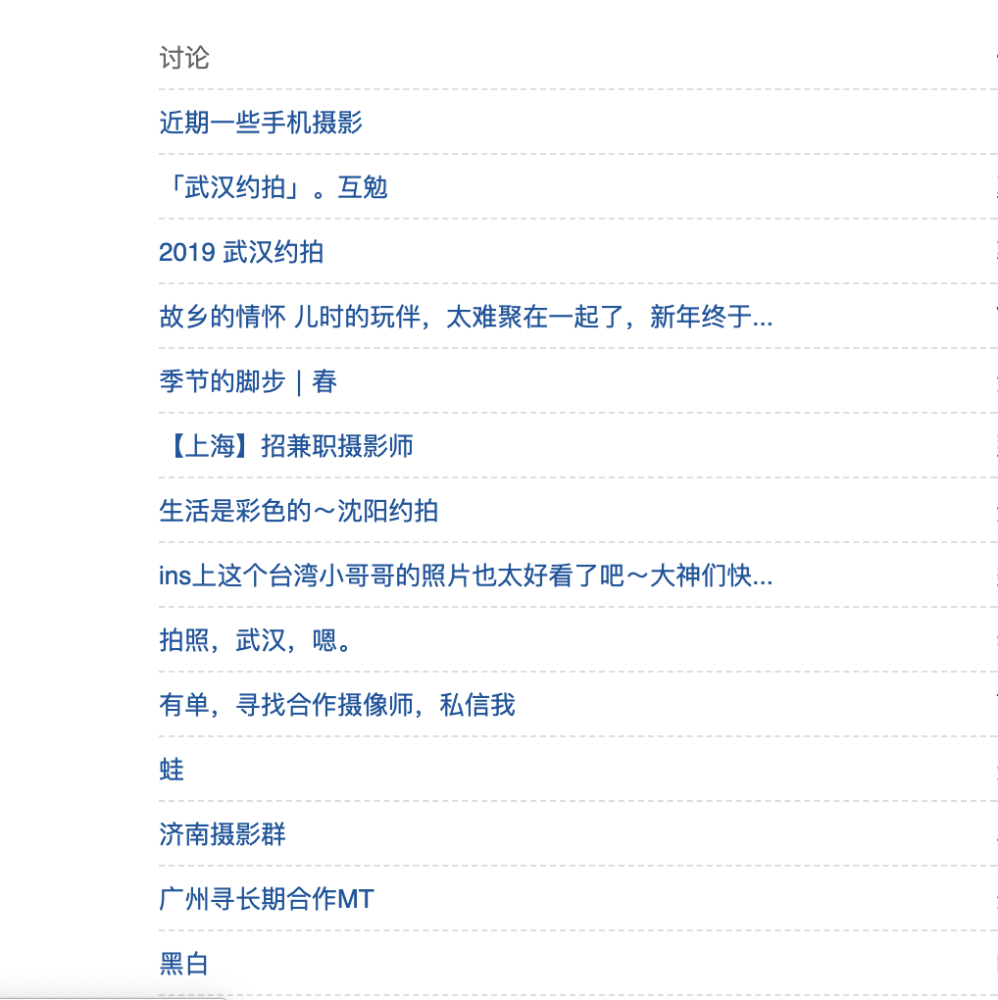
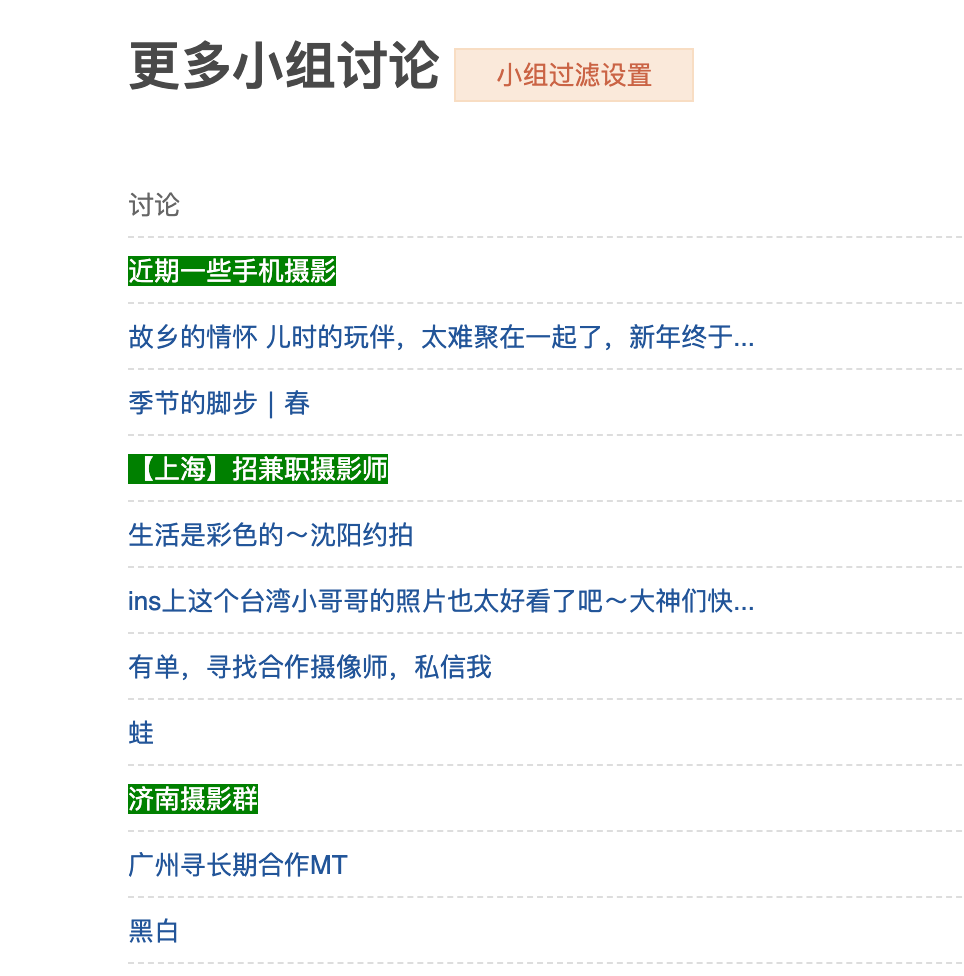

# douban-group-filter

## 介绍

仓库是为豆瓣小组写的 Tampermonkey 小插件，用于从豆瓣小组中高亮包含指定的关键字的帖子，并过滤掉包含想要排除的关键字的帖子。

## 使用

使用前：

设置高亮和排除的关键字

设置后：

**包含摄影的帖子已经被高亮，而包含武汉的帖子已被隐藏。**

## 问题反馈与功能增加
[Issues](https://github.com/tcatche/douban-group-filter/issues)

## 协议
[MIT](./LICENSE)